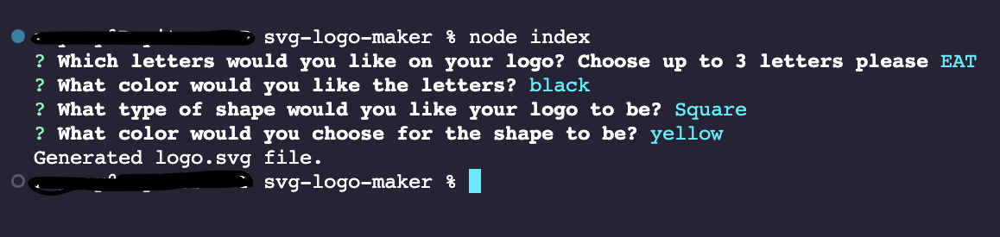

# svg-logo-maker

Table of Contents
- [Description](#description)
- [Live-screen-installation-and-function](#live-screen-installation-and-function)
- [Screenshot](#screenshot)
- [Technologies-used](#technologies-used)
- [How-to-Install](#how-to-install)
- [How-to-Use](#how-to-use)
- [Contributions](#contributions)
- [License](#license)
- [Questions](#questions)
- [Credits](#credits)

# Description
The purpose of this application was for the user a freelance web developer, to be able to create and generate a logo for their projects in order for them to avoid spending money on a graphic designer.

# Live-screen-installation-and-function
Below is the link in order for the user to follow in order to begin with the application.  
LINK for video:
https://drive.google.com/file/d/17C-xevYXeqbTQXZuM1ZBG-NVADIFsmAH/view?usp=share_link

# Screenshot

# Technologies-used
This project is powered by version 16 of Node.js, it also uses version 8.2.4 of inquirer. This project will also employ version 29.5.0 of jest for the unit testing perfomed.

# How-to-Install
1. First and foremost, the user should have the following three downloaded and installed already in their computer, those three are Node.js, jest, and npm.
2. The user would then have to clone the repository, by typing `git clone https://github.com/itsrayito/svg-logo-maker.git` into the chosen directory of the computer the user will be using into the Command Line Interface (CLI).
3. Next, the user will use the Command Line Interface to type `npm i` to install the dependencies that will be used with the application. 
4. To start this application, you will need to type in the command `node index`.

# How-to-Use
For this application to run, the user will use the command line to navigate to the directory where they placed the repository, the user will then install all dependencies needed by typing `npm i`, then the user will type `node index` to start the application. The user will then be asked a series of questions and answer them properly. Once after the questions have been answered, a message will show in the command line saying that the logo has been generated. The user will then find their new made logo.

# Contributions
At this time, there is no need for contributions. 

# License
MIT License

# Questions
You can [email](rayito.aguirre94@gmail.com) me if there is any questions or comments that arise from this application. 
You can also get a hold of me through my [GitHub](https://github.com/itsrayito) account.

# Credits
This application was made by Rayito Aguirre   
Lecture videos and class sessions on jest and Node.js provided by Rice University Coding Bootcamp in partnership with edX.

